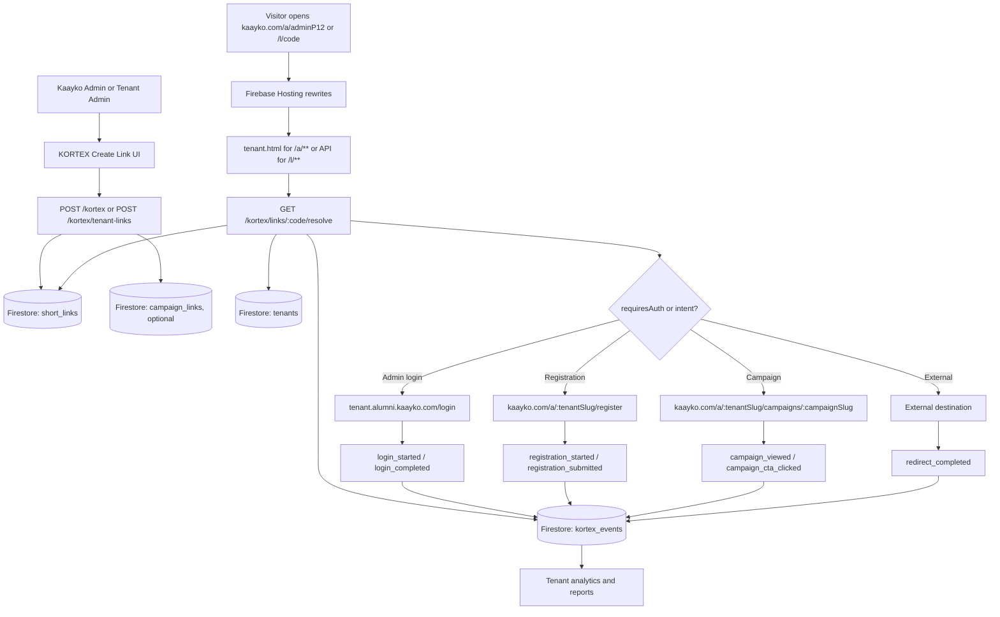

# KORTEX Tenant Experience Architecture Plan

## Summary

KORTEX is now the canonical tenant-link platform for Kaayko. Its job is to let Kaayko create small, trackable URLs for each tenant, then route those URLs into tenant admin login, alumni login, alumni registration, campaign pages, philanthropy campaigns, reports, and analytics.

This plan documents the production V2 foundation and the next architecture target: a dedicated `kortex.kaayko.com` tenant experience where Kaayko SuperAdmins can operate globally and tenant admins operate only inside their assigned tenant.

## Current Production Foundation

Deployed production foundation:

- Canonical API namespace: `/kortex`
- Backward-compatible API namespace: `/smartlinks`
- Universal short links: `https://kaayko.com/l/:code`
- Tenant alias links: `https://kaayko.com/a/:code`
- Tenant path shell: `https://kaayko.com/a/:tenantSlug/...`
- Tenant shell frontend: `src/tenant.html` + `src/js/tenant-portal.js`
- Admin create-link UI supports KORTEX V2 fields:
  - destination type
  - namespace
  - tenant slug
  - alumni domain
  - audience
  - intent
  - source
  - auth requirement

Existing compatibility remains:

- `/smartlinks` remains mounted for old clients.
- `/l/:code` remains the user-facing default for normal short links.
- Campaign namespace links `/:campaignSlug/:code` remain mounted and continue to resolve through campaign mirrors in `short_links`.
- `functions/api/smartLinks/*` remains as compatibility shims.

## Product URL Model

| URL | Purpose | Current status |
| --- | --- | --- |
| `https://kaayko.com/l/:code` | Universal short link | Live |
| `https://kaayko.com/a/:code` | Compact tenant alias, for example `/a/adminP12` | Live shell + API foundation |
| `https://kaayko.com/a/:tenantSlug/admin` | Tenant admin entry | Live shell + tenant bootstrap |
| `https://kaayko.com/a/:tenantSlug/register` | Tenant-scoped alumni registration | Live shell + intake submit |
| `https://kaayko.com/a/:tenantSlug/campaigns/:campaignSlug` | Tenant campaign/philanthropy entry | Live shell + event tracking |
| `https://:tenantSlug.alumni.kaayko.com/login` | Branded alumni or tenant login destination | Planned DNS/app routing |
| `https://kortex.kaayko.com/login` | Dedicated KORTEX login | Planned |
| `https://kortex.kaayko.com/t/:tenantSlug/dashboard` | Tenant dashboard | Planned |
| `https://kortex.kaayko.com/super-admin` | Global SuperAdmin console | Planned |

## Link Intent Model

Every KORTEX link can carry first-class intent fields:

| Field | Purpose |
| --- | --- |
| `tenantId` | Owns link, events, analytics, and access |
| `campaignId` | Connects link to campaign or philanthropy initiative |
| `destinationType` | What the link means |
| `requiresAuth` | Whether login is required before final destination |
| `audience` | `admin`, `alumni`, `donor`, `public`, or `invited` |
| `source` | `qr`, `email`, `sms`, `social`, `manual`, or `print` |
| `intent` | `login`, `register`, `view`, `donate`, `report`, or `share` |
| `returnTo` | Where the user continues after login |
| `conversionGoal` | Conversion event to optimize/report against |

Destination types:

- `tenant_admin_login`
- `tenant_alumni_login`
- `tenant_registration`
- `tenant_public_page`
- `tenant_dashboard`
- `campaign_landing`
- `campaign_member_view`
- `philanthropy_campaign`
- `donation_checkout`
- `campaign_report`
- `external_url`

## Architecture Flow



## Backend Architecture

Runtime owner: `kaayko-api/functions/index.js`

KORTEX backend modules:

- `functions/api/kortex/smartLinks.js`
  - main KORTEX router
  - canonical `/kortex` endpoints
  - backward-compatible `/smartlinks` mount
- `functions/api/kortex/v2LinkIntents.js`
  - destination types
  - tenant resolution
  - tenant alias creation
  - event ledger writes
  - tenant analytics aggregation
- `functions/api/kortex/smartLinkService.js`
  - core short link CRUD
  - writes `short_links`
  - stores V2 intent fields
- `functions/api/kortex/redirectHandler.js`
  - public redirect behavior
  - platform routing
  - V2 intent-aware redirects
- `functions/api/campaigns/*`
  - campaign CRUD and campaign link mirrors
  - still mounted as `/campaigns`
  - conceptually belongs to KORTEX, but public paths remain compatible
- `functions/api/deepLinks/deeplinkRoutes.js`
  - owns `/l/:id`
  - delegates KORTEX short links to canonical redirect handler

Key API surfaces:

```text
GET  /kortex/health
GET  /kortex/tenants/resolve
GET  /kortex/tenants/:tenantSlug/bootstrap
GET  /kortex/links/:code/resolve
POST /kortex/events
POST /kortex/tenant-links
GET  /kortex/tenants/:tenantId/analytics
POST /kortex/tenant-registration

POST /kortex
GET  /kortex
GET  /kortex/:code
PUT  /kortex/:code
DELETE /kortex/:code
GET  /kortex/r/:code

GET/POST/PUT/DELETE /campaigns...
GET /:campaignSlug/:code
GET /l/:id
```

## Frontend Architecture

Current KORTEX frontend modules:

- `src/admin/kortex.html`
  - authenticated admin app shell
  - dashboard, links, campaigns, analytics, billing, QR, tenant onboarding
- `src/admin/views/create-link/create-link.js`
  - V2 link intent fields
  - creates `/kortex/tenant-links` when namespace is set
  - preserves normal `/l/:code` behavior otherwise
- `src/admin/js/config.js`
  - canonical API fetch
  - rewrites `/smartlinks` to `/kortex` for compatibility
- `src/tenant.html`
  - path-based tenant shell
- `src/js/tenant-portal.js`
  - resolves `/a/:code`
  - bootstraps `/a/:tenantSlug/...`
  - tracks registration/campaign/login events

Hosting rewrites:

```text
/api/**   -> function api
/l/**     -> function api
/a/**     -> /tenant.html
/login    -> /tenant.html
/resolve  -> function api
/health   -> function api
```

## Dedicated KORTEX App Target

Next target: `kortex.kaayko.com`

Routes:

```text
kortex.kaayko.com/login
kortex.kaayko.com/select-tenant
kortex.kaayko.com/super-admin
kortex.kaayko.com/t/:tenantSlug/dashboard
kortex.kaayko.com/t/:tenantSlug/links
kortex.kaayko.com/t/:tenantSlug/campaigns
kortex.kaayko.com/t/:tenantSlug/alumni
kortex.kaayko.com/t/:tenantSlug/philanthropy
kortex.kaayko.com/t/:tenantSlug/analytics
kortex.kaayko.com/t/:tenantSlug/settings
```

Login rules:

- SuperAdmin can log in without selecting a tenant.
- SuperAdmin lands in `/super-admin`.
- SuperAdmin can switch into any tenant intentionally.
- Non-SuperAdmin users must have at least one tenant assignment.
- Users with one tenant go directly to that tenant dashboard.
- Users with multiple tenants must select a tenant first.
- Tenant admins cannot access another tenant by typing a URL.
- Backend enforces tenant access even when the frontend sends a bad tenant header.

Required backend additions:

```text
GET  /kortex/me
POST /kortex/session/tenant
GET  /kortex/admin/tenants
POST /kortex/admin/tenants
POST /kortex/admin/tenants/:tenantId/admin-users
GET  /kortex/admin/tenants/:tenantId/health
```

## Data Model

Current collections:

- `short_links`
- `campaigns`
- `campaign_links`
- `kortex_events`
- `link_analytics`
- `click_events`
- `tenants`
- `admin_users`
- `pending_tenant_registrations`
- `subscriptions`

Recommended additions:

- `tenant_memberships`
- `tenant_domains`
- `tenant_sessions`
- `tenant_pages`
- `tenant_registration_requests`
- `philanthropy_campaigns`
- `donation_intents`
- `kortex_daily_metrics`

## Analytics Model

KORTEX V2 event types:

- `link_clicked`
- `redirect_completed`
- `login_started`
- `login_completed`
- `registration_started`
- `registration_submitted`
- `campaign_viewed`
- `campaign_cta_clicked`
- `donation_started`
- `donation_completed`
- `report_opened`
- `qr_scanned`

Dashboards should aggregate:

- clicks by tenant
- clicks by link
- clicks by campaign
- conversions by source
- registrations attributed to links
- alumni logins attributed to links
- philanthropy views
- donation starts/completions
- QR versus email/SMS/social/print
- broken, expired, or disabled links

## Rollout Plan

1. Commit deployed V2 foundation to both `main` repos.
2. Create or attach Firebase Hosting site for `kortex.kaayko.com`.
3. Build the dedicated KORTEX login shell.
4. Add `/kortex/me` and active tenant session APIs.
5. Implement SuperAdmin global console.
6. Implement tenant selection and tenant-scoped routing.
7. Move current admin views behind `/t/:tenantSlug/...`.
8. Convert create-link into template-based flows.
9. Add tenant analytics and report dashboards.
10. Add branded subdomain routing for `:tenantSlug.alumni.kaayko.com`.
11. Add domain verification and custom domains.

## Acceptance Criteria

- Existing `/l/:code` links continue to work.
- Existing campaign namespace links continue to work.
- Existing `/smartlinks` compatibility continues to work.
- Admin can create `https://kaayko.com/a/adminP12`.
- That link resolves through `/kortex/links/adminP12/resolve?namespace=a`.
- Click events are recorded in `kortex_events`.
- Tenant registration submits through `/kortex/tenant-registration`.
- `kortex.kaayko.com/login` supports SuperAdmin and tenant admin routing.
- Tenant admins cannot read or mutate another tenant's links.
- SuperAdmin can operate globally and switch tenant context intentionally.
